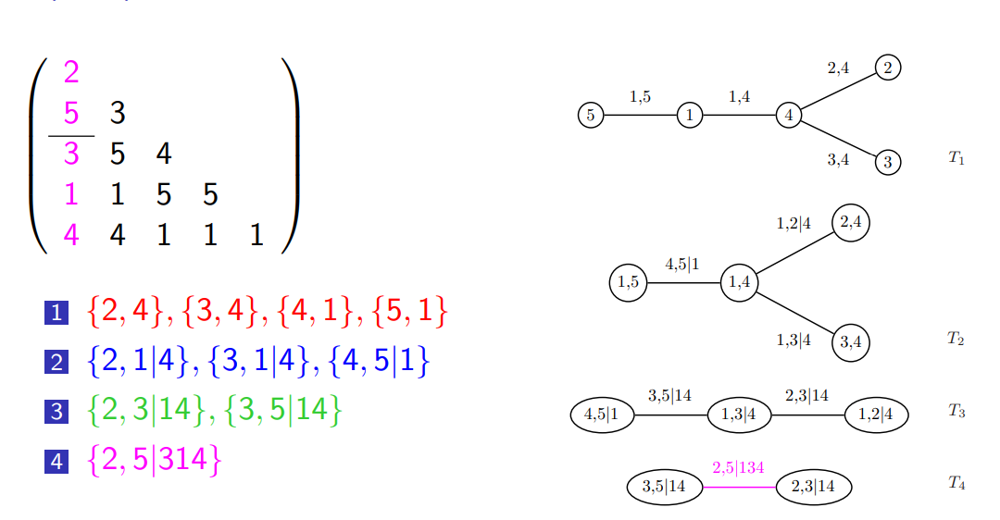

<style>
body{
  font-family: 'Oxygen', sans-serif;
  font-size: 16px;
  line-height: 24px;
}

h1,h2,h3,h4 {
  font-family: 'Raleway', sans-serif;
}

.container { width: 1000px; }
h2, h3 {
  background-color: #D4DAEC;
  text-indent: 100px; 
}
h4 {
  text-indent: 100px;
}

g-table-intro h4 {
  text-indent: 0px;
}
</style>


```{r, warning=FALSE, message=FALSE}
library(latex2exp)
library(rugarch)
library(ggplot2)
library(VineCopula)
```

Following [1](https://www.birs.ca/workshops/2013/13w5146/files/Brechmann.pdf)

# Visualizing the Clayton-Gumbel (BB1) copula


```{r}
obj <- BiCop(family = 7, par = 0.25, par2 = 2.5)
plot(obj)  # surface plot of copula density
contour(obj)  # contour plot with standard normal margins
contour(obj, margins = "unif")  # contour plot of copula density

```
## Sampling

```{r}
plot(BiCopSim(N=1500, family=7, par=0.25, par2=2.5), ylab="z_2", xlab="z_1")
```
# R Vines

Vines have to be represented in an efficient manner in order to be used in copula models. One encoding is due to Morales-N´apoles et al. (2010). The encoding rule for an n-vine is as follows:

- Start with a diagonal entry, $\mathcal R_{ii}$. 
- Work down the column to some $\mathcal R_{ji}$ s.t $j=n-2$.
- The two entries $\mathcal R_{ki}$, $k\geq j$ are the node links
- Enumerate the connections of $T_1$ 

Build $T_k$ recursively by choosing appropriate stopping points in the column. For instance, the links of $T_4$ are given by choosing column $1$ and row $j=3$:


```{r}
vine.matrix_ <- matrix(c(2,5,3,1,4,0,3,5,1,4,0,0,4,5,1,0,0,0,5,1,0,0,0,0,1), 5, 5)
family <- matrix(c(0,1,3,4,4,0,0,3,4,1,0,0,0,4,1,0,0,0,0,3,0,0,0,0,0), 5, 5)
par <- matrix(c(0,0.2,0.9,1.5,3.9,0,0,1.1,1.6,0.9,0,0,0,1.9,0.5,0,0,0,0,4.8,0,0,0,0,0), 5, 5)
par2 <- matrix(0, 5, 5)
vine.matrix <- RVineMatrix(vine.matrix_, family=family, par=par, par2=par2, names=c("u1", "u2", "u3", "u4", "u5"))
plot(RVineSim(500, vine.matrix))

```

